# Space Missions Analysis
This repository contains an analysis of a dataset containing information about space missions. The dataset includes information about space missions from 1957 to 2020. Including the mission name, the date of launch, the rocket company, and the mission status.

---

##  Introduction

The field of space exploration has been an area of great interest and innovation for decades. With each new mission, we learn more about the universe and our place in it. The Space Race of the mid-20th century between the United States and the Soviet Union spurred some of the greatest advancements in space exploration, including the first manned missions and the first moon landing. Since then, numerous countries and private companies have entered the field, with the goal of expanding our knowledge of the universe and, in some cases, commercializing space travel.

In this project, we will be analyzing a dataset of space missions to gain insights into the trends and patterns in space exploration. We will be using Python and various data analysis libraries, such as Pandas and Matplotlib, to clean and manipulate the data and generate visualizations to aid in our analysis. Some of the questions we will be exploring include the success rate of rocket launches for different companies, the number of space missions launched each year, and the most common types of missions for each company. Through this analysis, we hope to gain a deeper understanding of the history and current state of space exploration.

---

## About the data

**Company** - Company responsible for the space mission

**Location** - Location of the launch

**Date** - Date of the launch

**Time** - Time of the launch (UTC)

**Rocket** - Name of the rocket used for the mission

**Mission** - Name of the space mission (or missions)

**RocketStatus** - Status of the rocket as of August 2022 (Active or Inactive)

**Price** - Cost of the rocket in millions of US dollars

**MissionStatus** - Status of the mission (Success, Failure, Partial Failure, Prelaunch Failure)

---

## Installation
To run the analysis, you need to have Python 3 and the following libraries installed:

    pandas
    matplotlib
    seaborn

---

## Data Cleaning
Before performing any analysis, the data was cleaned by:

- Converting the date column to a datetime data type.

- Removing the commas from the price column.

- Converting the price column to a numeric data type.

- Dropping the entire price column because the majority of the data is missing.

- Dropping rows with missing values.

- Dropping duplicated rows.

---

## Analysis
The analysis includes the following:

- Analyzing the success rate of rocket launches for different companies.

- Plotting the number of missions by year to see how the frequency of space launches has changed over time.

- Counting the number of missions by year and computing the year with the most and the least amount of missions to date.

- Counting the number of successful and failed missions and computing the success and failure rates.

- Creating a pie chart to visualize the distribution of mission statuses.

- Calculating the most common mission types for each company.

- Analyzing the success rate of missions by company.

---

## Conclusion
The analysis provides insights into the success rate of rocket launches for different companies and the number of space missions over time. It also highlights the most common mission types for each company and the success rate of missions by company. The analysis can be used to inform decision-making related to space exploration and investment in space-related industries.

---

## Images and Insights
**Additional insights can be gained iniside the Analysis [Analysis](./SpaceMissions.ipynb)**

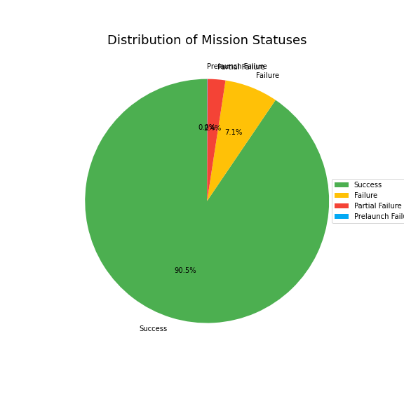

From this chart, we can see that the majority of missions are successful (90.5%), followed by failed missions (7.1%). This indicates that space exploration has been generally successful, despite the occasional setbacks.

---

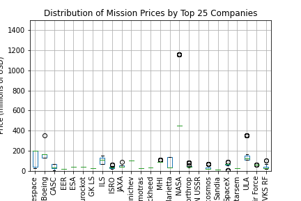

This box plot shows the distribution of mission prices for the top 25 companies ranked by average mission price. From the plot, we can see that some companies have a wider range of mission prices than others. Additionally, we can see that the median price for most of the companies is below 500 million USD. The plot also shows a few outliers with very high mission prices, particularly for NASA. Overall, this plot provides a useful comparison of the mission prices for the top companies in the space industry.

---

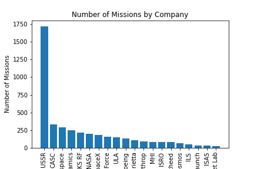

This chart shows the number of missions carried out by the top 20 companies in the space industry. From the chart, we can see that the company with the most number of missions is RSVN USSR, followed by CASC and then Arianespace. It is also interesting to note that most of the companies in the top 20 are private companies, indicating the increasing role of private companies in the space industry.

---

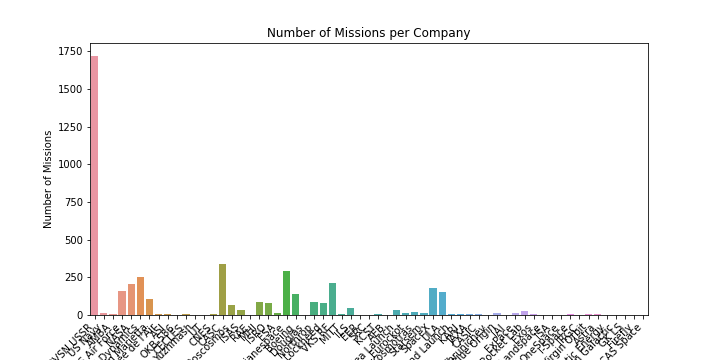

The bar chart shows the number of missions carried out by each company in the dataset. We can observe that most of the missions were carried out by the Russian space agencies (RVSN USSR and Roscosmos). We can also see that there are many smaller companies that have carried out only a few missions. This chart provides a quick overview of the distribution of missions among different companies and can help us identify which companies have been the most active in the space industry.

---

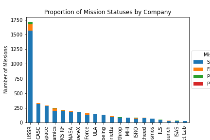

The stacked bar chart provides insights into the proportion of mission statuses for each company. The height of each bar represents the total number of missions for a particular company, and the different colors represent the proportion of mission statuses for each company. For instance, the chart shows that RSVN USSR has the highest number of successful missions. The chart shows the relative success rates of different companies in the space industry.

---

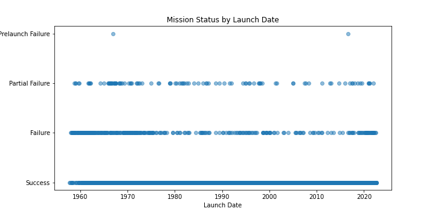

This scatter plot shows the relationship between launch date and mission status. The x-axis represents the launch date, while the y-axis represents the mission status. Each point on the scatter plot represents a mission, and the color of the point indicates the mission status. The plot shows that there is no clear relationship between launch date and mission status. The number of successful and failed missions is roughly the same across all years, indicating that mission success is not strongly correlated with launch date. However, there appears to be a higher number of partial missions in the earlier years of the dataset. This could indicate that mission technology has improved over time, resulting in fewer partial missions.

---

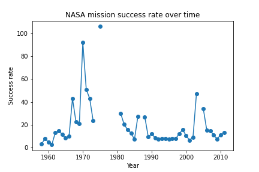

The chart shows the success rate of NASA missions over time, which could provide insights into the development of the space industry. For example, if the success rate increases over time, it may suggest improvements in technology and processes. Conversely, if the success rate decreases, it may indicate challenges or setbacks faced by NASA. By analyzing the types of payloads carried by each rocket and the destinations of the payloads, it may be possible to identify trends and shifts in the industry, such as a greater focus on commercial satellite launches or an increase in missions to explore Mars.

---

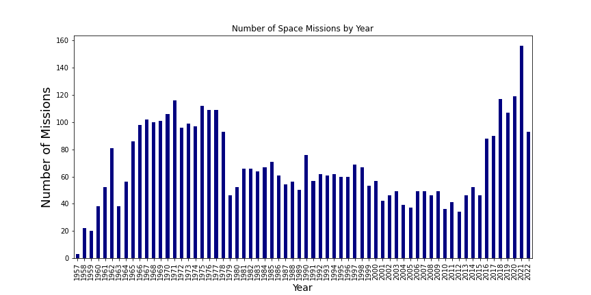

From this plot we can see that the number of space launches increased rapidly in the 1960s and peaked in the 1970s. After a decline in the 1980s, the number of missions has remained relatively stable at around 50-100 per year.

---

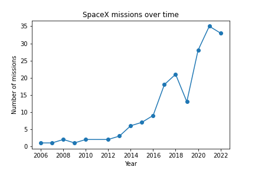

The line plot shows the number of SpaceX missions launched each year over time. From the chart, we can observe the following insights:

The number of SpaceX missions has been increasing over time, with a sharp increase in recent years.

There were no missions launched by SpaceX before 2006.

SpaceX launched its first mission in 2006 and did not have any significant launches until 2010.

The company launched only a few missions each year until 2015, after which the number of missions increased rapidly.

The most number of missions SpaceX launched in a year occurred in 2021.

There seems to be a periodicity in the number of launches, with a cycle of high and low launch years. However, this cycle is not very clear, and there are a lot of variations in the number of launches from year to year.

SpaceX has been rapidly increasing its launch capabilities over the years, and is now one of the most active players in the space industry.

---

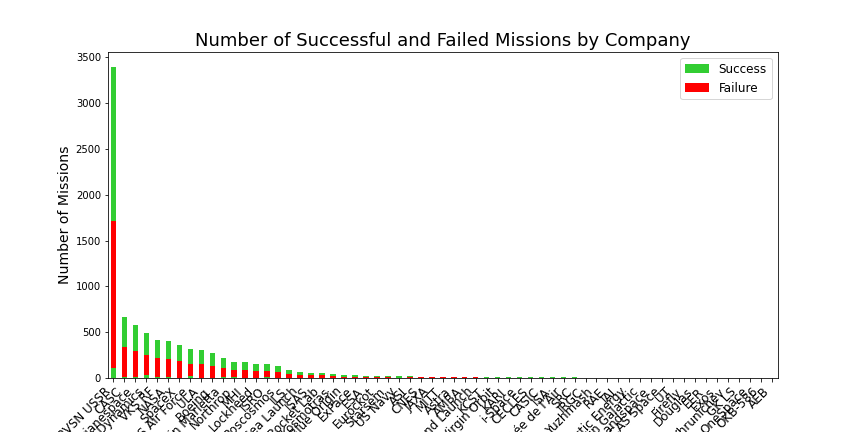

The bar chart shows the number of successful and failed missions for each company. The height of each bar represents the total number of missions, while the color of the segments within each bar indicates the number of successful (limegreen) and failed (red) missions.

---

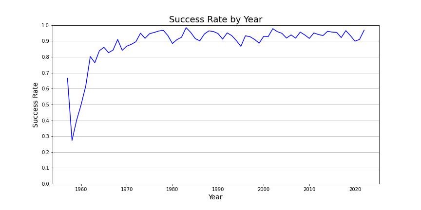

The line chart shows the success rate of space missions over time. The overall trend shows an increase in the success rate over time, with some fluctuations from year to year. The chart also highlights some interesting periods, such as the early 2000s when the success rate dropped significantly, and the recent years, where the success rate has been consistently high. Overall, the chart provides a useful overview of the success rate of space missions and how it has evolved over time.

---

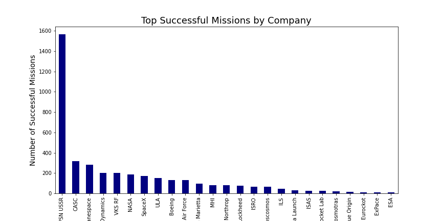

This chart shows the top 25 companies with the highest number of successful missions. The top company is RVSN USSR, followed by CASC and Arianespace. The number of successful missions for these companies ranges from around 67 to over 1500.

The chart provides an indication of which companies have been most successful in terms of completing their missions, and it can be used to identify companies that have a proven track record of success.

However, it's important to note that the number of successful missions may not necessarily be the best indicator of a company's overall performance or capabilities.

---
